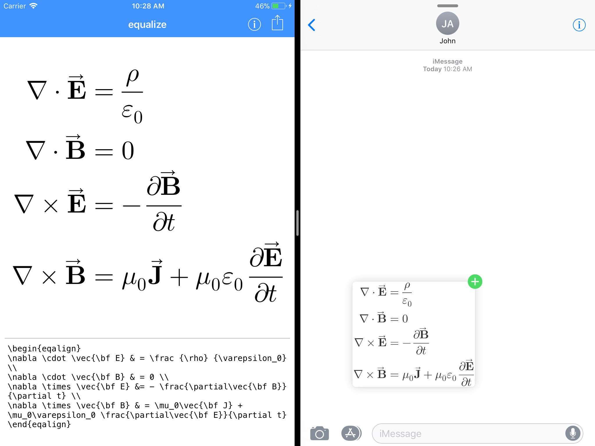
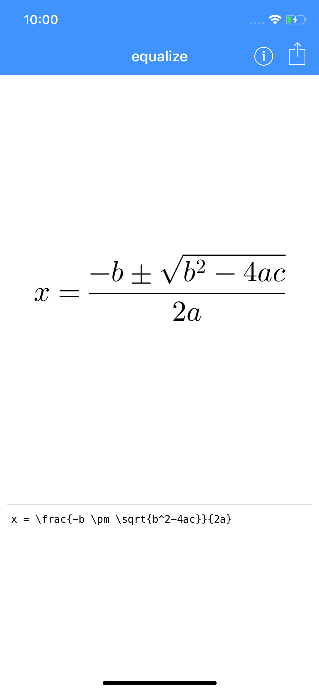

# equalize

Easily type LaTeX equations and drag or copy them anywhere as images.

Ever needed to send someone an equation they asked for? Want to add them to a note, but can't read your own handwriting?

Just jot down some LaTeX or TeX equations and drag them to where you want them or use the share sheet.

Interested in becoming a TestFlight beta tester? Write me an [email](mailt:contact.kamik423@gmail.com), or send me [a reddit PM](https://www.reddit.com/message/compose/?to=Kamik423).

## Issues and Suggestions

Feel free to add issues and suggestions to the [issue tracker here on GitHub](https://github.com/Kamik423/equalize/issues).

[Issues List](https://github.com/Kamik423/equalize/issues)

[New Issue](https://github.com/Kamik423/equalize/issues/new)

